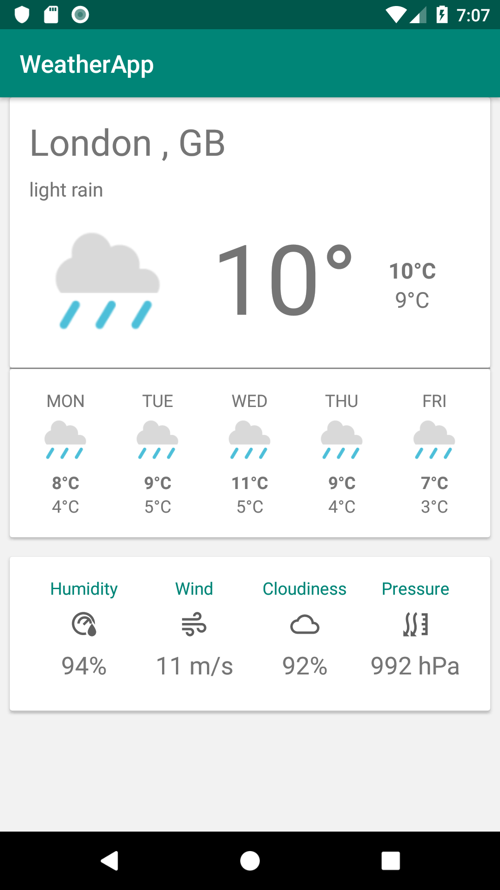

# WeatherApp
A simple Weather App

1. TDD is used. If you look at the commit history, you will see the hisory of the View Model development for validating longitude and latitude and then the data from the weather services.
2. The language of preference is Kotlin.
2. The architecture that I have used is MVVM.
3. It uses the Android Architecture Components.
4. DataBinding and LiveData, This allows the components in your app to be able to observe LiveData objects for changes without creating explicit and rigid dependency paths between them. This decouples completely the LiveData object producer from the LiveData object consumer.
5. Includes both unit tests and instrumentation tests. 
6. I have used the principles of singularity of responsibility and integration segregation ( SOLID ) and so kept the services separate.
7. I inject dependencies into the ViewModel. Dependency Injection is a form of Dependency Inversion ( SOLID ). I am using Dagger 2 to facilitate Dependency Injection.
8. I have called the Dagger component interface, RepositoryInjector, since, its main task, currently, is to have multiple repositories access the 
networking services, instead of the usual naming convention of networkcomponent. I hope that wasn’t confusing. Each time we introduce a new Repository, it is added to this file.
9. Mockito 2 is able to mock it all,but it is experimental, and requires a manual activation.A textfile, called org.mockito.plugins.MockMaker, in the test/resources/mockito-extensions folder.
10. Allows longitude and latitude or city name to retrieve weather data from the service.
11. 5 day forecast is available at any location or city. It includes weather data every 3 hours. Forecast is available in JSON or XML format.
12. Uses clear code, separation of concern: MVVM with a data repository layer and livedata to allow loose coupling.

TODO:

1. Improve the input location/city UI screen.

RECOMMENDATIONS:

SCREENSHOTS:

